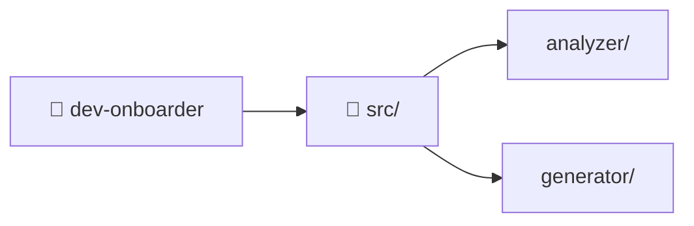
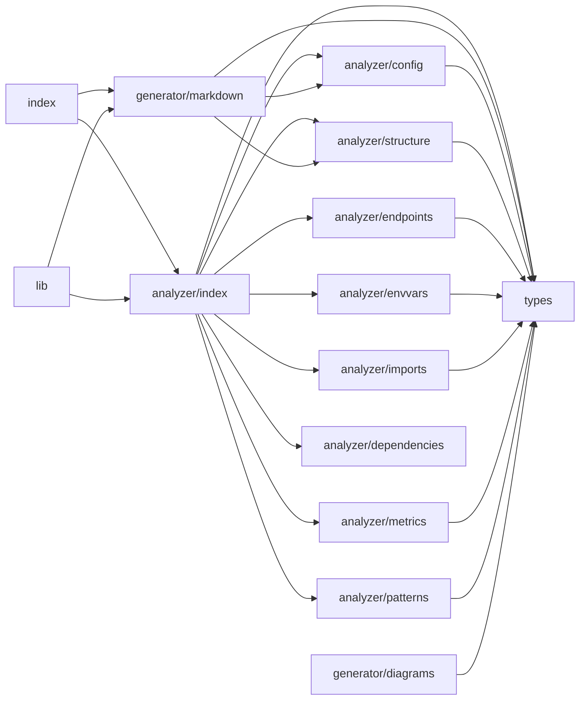

# 🚀 Guía de Onboarding: dev-onboarder

> Guía auto-generada por **project-onboarder** para facilitar la incorporación de nuevos desarrolladores.

---

## 📑 Tabla de Contenidos

- [Resumen del Proyecto](#-resumen-del-proyecto)
- [Quick Start](#-quick-start)
- [Dónde Empezar](#-dónde-empezar)
- [Métricas del Proyecto](#-métricas-del-proyecto)
- [Arquitectura y Diagrama](#-arquitectura-y-diagrama)
- [Estructura del Proyecto](#-estructura-del-proyecto)
- [Stack Tecnológico](#-stack-tecnológico)
- [Patrones de Diseño](#-patrones-de-diseño)
- [Variables de Entorno](#-variables-de-entorno)
- [Estilos](#-estilos)
- [Estado Global](#-estado-global)
- [Data Fetching](#-data-fetching)
- [Base de Datos](#-base-de-datos)
- [Autenticación](#-autenticación)
- [Testing](#-testing)
- [Scripts Disponibles](#-scripts-disponibles)
- [Archivos de Configuración](#-archivos-de-configuración)
- [Flujo de Datos](#-flujo-de-datos)
- [Grafo de Dependencias Internas](#-grafo-de-dependencias-internas)
- [Dependencias Principales](#-dependencias-principales)

---

## 📋 Resumen del Proyecto

| Aspecto | Detalle |
|---------|--------|
| **Framework** | Desconocido  |
| **Tipo** | ❓ Desconocido |
| **Package Manager** | npm |
| **Total Dependencias** | 6 (4 prod + 2 dev) |
| **Estilos** | CSS estándar |
| **Testing** | No detectado |
| **Archivos** | 18 (4931 líneas) |
| **TypeScript** | 100% del código |

> No se pudo detectar el framework principal del proyecto.

---

## ⚡ Quick Start

```bash
# 1. Clonar el repositorio
git clone <url-del-repo>
cd dev-onboarder

# 2. Instalar dependencias
npm install

# 3. Iniciar en modo desarrollo
npm run dev
```

---

## 🧭 Dónde Empezar

### Entry Points

| Archivo | Tipo | Descripción |
|---------|------|-------------|
| `src/lib.ts` | 📦 Main | Entry point principal definido en package.json (main) |
| `src/index.ts` | 📦 Main | CLI binary "project-onboarder" |
| `src/types.ts` | 🔧 Hub | Archivo hub (importado por 10 archivos) |
| `src/analyzer/config.ts` | 🔧 Hub | Archivo hub (importado por 2 archivos) |
| `src/analyzer/index.ts` | 🔧 Hub | Archivo hub (importado por 2 archivos) |

### Archivos más importados (hubs del proyecto)

Estos archivos son los "centros" del proyecto. Si los entiendes, entiendes el proyecto:

| Archivo | Importado por |
|---------|---------------|
| `src/types.ts` | 10 archivos |
| `src/analyzer/config.ts` | 2 archivos |
| `src/analyzer/index.ts` | 2 archivos |
| `src/analyzer/structure.ts` | 2 archivos |
| `src/generator/markdown.ts` | 2 archivos |

### Tips de navegación

- **Necesitas ver el código fuente?** → Mira `src/`

---

## 📊 Métricas del Proyecto

| Métrica | Valor |
|---------|-------|
| **Total archivos** | 18 |
| **Total líneas** | 4931 |
| **TypeScript** | 100% |

### Desglose por lenguaje

| Extensión | Archivos | Líneas |
|-----------|----------|--------|
| `.ts` | 15 | 3976 |
| `.json` | 3 | 955 |

### Archivos más grandes

| Archivo | Líneas |
|---------|--------|
| `package-lock.json` | 888 |
| `src/types.ts` | 735 |
| `src/generator/markdown.ts` | 606 |
| `src/analyzer/framework.ts` | 480 |
| `src/generator/diagrams.ts` | 290 |
| `src/analyzer/patterns.ts` | 256 |
| `src/analyzer/imports.ts` | 252 |
| `src/analyzer/endpoints.ts` | 243 |

---

### Diagrama de Estructura



---

## 📁 Estructura del Proyecto

```
dev-onboarder/
├── src/
│   ├── analyzer/
│   │   ├── config.ts
│   │   ├── dependencies.ts
│   │   ├── endpoints.ts
│   │   ├── envvars.ts
│   │   ├── framework.ts
│   │   ├── imports.ts
│   │   ├── index.ts
│   │   ├── metrics.ts
│   │   ├── patterns.ts
│   │   └── structure.ts
│   ├── generator/
│   │   ├── diagrams.ts
│   │   └── markdown.ts
│   ├── index.ts
│   ├── lib.ts
│   └── types.ts
├── package-lock.json
├── package.json
├── README.md
└── tsconfig.json
```

### Directorios Clave

| Directorio | Propósito |
|------------|----------|
| `src/` | Código fuente principal de la aplicación |

---

## 🛠️ Stack Tecnológico

---

## 🎯 Patrones de Diseño

### Estructura simple

El proyecto no sigue un patrón arquitectónico complejo. Los archivos se organizan por tipo (componentes, utils, etc.).

**Evidencia:** Estructura plana de directorios

---

## 🔑 Variables de Entorno

El proyecto usa 3 variables de entorno:

| Variable | Requerida | Valor por defecto | Fuente | Descripción |
|----------|-----------|-------------------|--------|-------------|
| `VAR_NAME` | ✅ Sí | - | `src/analyzer/envvars.ts` | - |
| `VITE_XXX` | ✅ Sí | - | `src/analyzer/envvars.ts` | - |
| `XXX` | ✅ Sí | - | `src/analyzer/envvars.ts` | - |

---

## 🎨 Estilos

El proyecto usa CSS estándar sin librerías adicionales.

---

## 📦 Estado Global

No se detectó una librería de estado global. El proyecto probablemente usa:
- React Context API
- Estado local con `useState` / `useReducer`
- Server state via framework (Next.js Server Components, etc.)

---

## 📡 Data Fetching

No se detectó una librería dedicada de data fetching. El proyecto probablemente usa:
- `fetch` nativo del navegador/Node.js
- Data fetching del framework (loaders, server components, etc.)

---

## 🗄️ Base de Datos

No se detectó un ORM o cliente de base de datos.

---

## 🔐 Autenticación

No se detectó una librería de autenticación dedicada.

---

## 🧪 Testing

⚠️ No se detectaron herramientas de testing configuradas.


---

## 📜 Scripts Disponibles

| Script | Comando | Descripción |
|--------|---------|-------------|
| `npm run build` | `tsc` | Compila el proyecto para producción |
| `npm run start` | `node dist/index.js` | Inicia la aplicación en producción |
| `npm run dev` | `ts-node src/index.ts` | Inicia el servidor de desarrollo |

---

## ⚙️ Archivos de Configuración

| Archivo | Herramienta | Propósito |
|---------|-------------|----------|
| `tsconfig.json` | TypeScript | Configuración del compilador TypeScript (strict mode, paths, target, etc.) |

---

## 🕸️ Grafo de Dependencias Internas

Relaciones de imports entre los archivos principales del proyecto:



---

## 📦 Dependencias Principales

### Producción (4)


### Desarrollo (2)


---

> 📝 *Esta guía fue generada automáticamente por [project-onboarder](https://github.com/project-onboarder).*
> *Última generación: 24 de abril de 2026*
